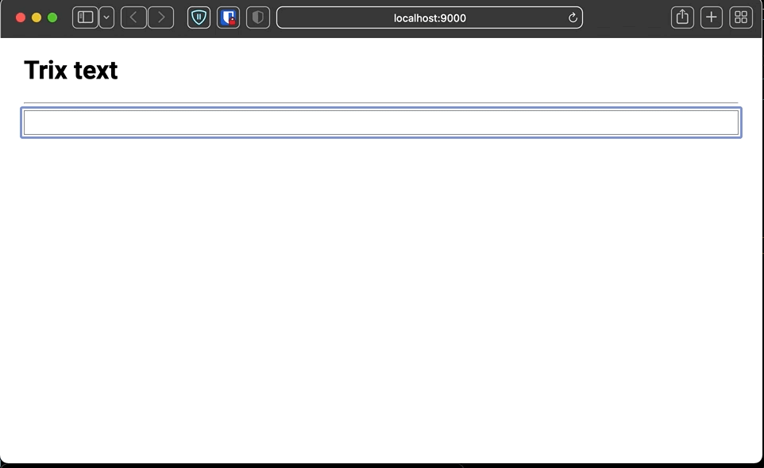

# Mention test

Working on an html chat app.

I want to test out doing mentions `@...`

Here is the final outcome.

## Process

Tried out https://trix-editor.org but had a big size

Tried out https://github.com/jaredreich/pell and looked at the source.

Rolled my own content editable editor https://developer.mozilla.org/en-US/docs/Web/Guide/HTML/Editable_content

See [PellEditor.tsx](./src/PellEditor.tsx) (its called pell but its custom)